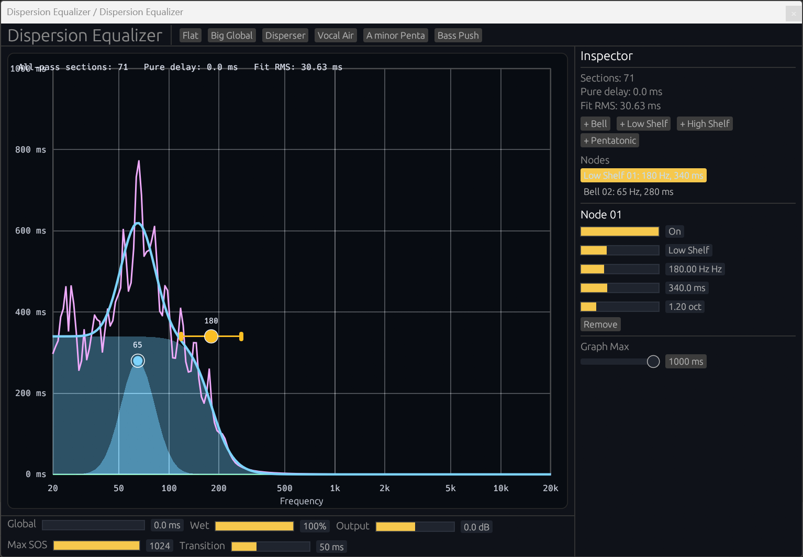

# Dispersion Equalizer



Dispersion Equalizer is a group-delay EQ built with Rust and NIH-plug. Instead of changing gain per frequency band, it changes arrival time per frequency band with pure delay and all-pass filters while keeping the wet path as amplitude-flat as practical.

Current MVP features:

- CLAP/VST3 build targets through NIH-plug
- Global Delay
- Bell Delay nodes
- Bell/Shelf/Scale delay nodes
- Fixed 16 node slots for DAW automation
- Dark egui graph editor with target/actual delay curves
- Node add/select/drag/duplicate/remove
- Built-in starter presets
- DSP unit tests for delay line, all-pass stability, compiler behavior, and graph mapping

The plugin is designed around 100% wet use. Lower wet values intentionally blend dry and phase-shifted wet audio, so comb filtering can occur.

## Building

After installing [Rust](https://rustup.rs/), you can compile Dispersion Equalizer as follows:

```shell
cargo xtask bundle dispersion_equalizer --release
```

For development checks:

```shell
cargo check
cargo test
```

Release instructions are documented in `docs/release.md`.

CLAP, VST3, and AUv2 (Audio Unit) are shipped in every release. macOS builds are Universal Binary (arm64 + x86_64), Developer ID signed, and notarized.

## Audio Unit (AUv2) on macOS

The macOS DMG includes an AUv2 `.component` for Logic Pro and GarageBand.

**Install:**

```bash
cp -R "Dispersion Equalizer.component" ~/Library/Audio/Plug-Ins/Components/
```

**If macOS blocks the plugin (unsigned/quarantine):**

```bash
xattr -dr com.apple.quarantine ~/Library/Audio/Plug-Ins/Components/"Dispersion Equalizer.component"
```

**Validate:**

```bash
auval -strict -v aufx DsEQ Zuky
```

Then rescan Audio Units in your DAW or restart it.
